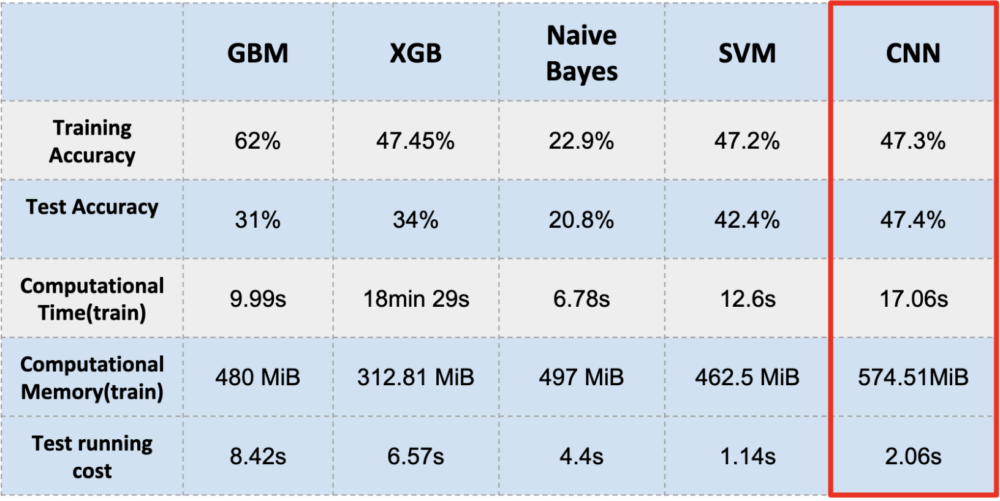

# Project: Can you recognize the emotion from an image of a face? 

(Image source: https://www.pnas.org/content/111/15/E1454)

### [Full Project Description](doc/project3_desc.md)

Term: Fall 2019

+ Team 1
+ Team members
	+ Suzy Gao
	+ Bingqian Wu
	+ Tushar Vijay Ponkshe
	+ Lulu Dong
	+ Daniel Lee

+ Project summary: In this project, we created a classification engine for facial emotion recognition. We used multiple models to imporve accuracy of emotion recognition. We used:
	+ GBM (Gradient Boosting Machine)
	+ XGBoost
	+ SVM (Support Vector Machine)
	+ CNN (Convolutional Neural Network)
	+ Naive Bayes Classifier

 

We set GBM model as the baseline model and tried other models for better accuracy. We read images and extracted fidicual points to calculated distance between these points. With this feature data, we ran models to see which one has the best accuracy. Also, we considered processing time and computing memory usage of each models to finally select the best model.
	
**Contribution statement**: ([Here](doc/a_note_on_contributions.md)) 

Following [suggestions](http://nicercode.github.io/blog/2013-04-05-projects/) by [RICH FITZJOHN](http://nicercode.github.io/about/#Team) (@richfitz). This folder is orgarnized as follows.

```
proj/
├── lib/
├── data/
├── doc/
├── figs/
└── output/
```

Please see each subfolder for a README file.
